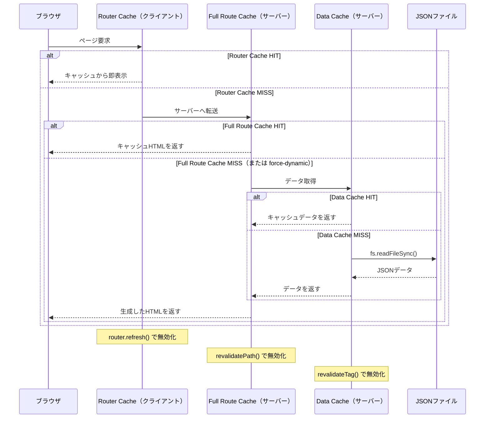
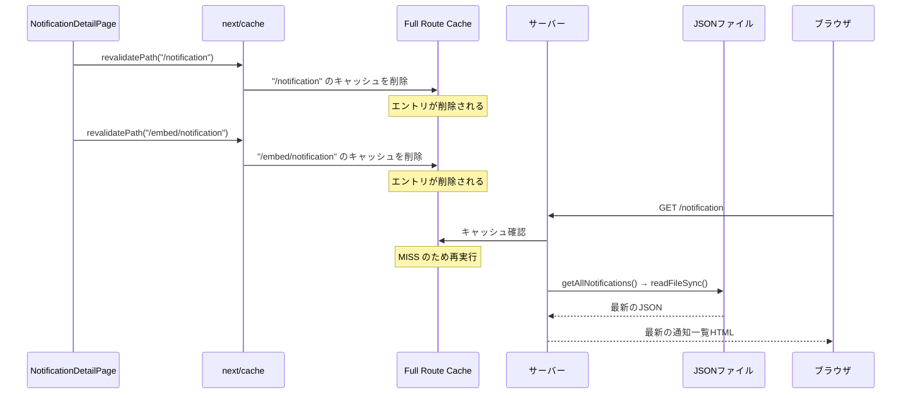
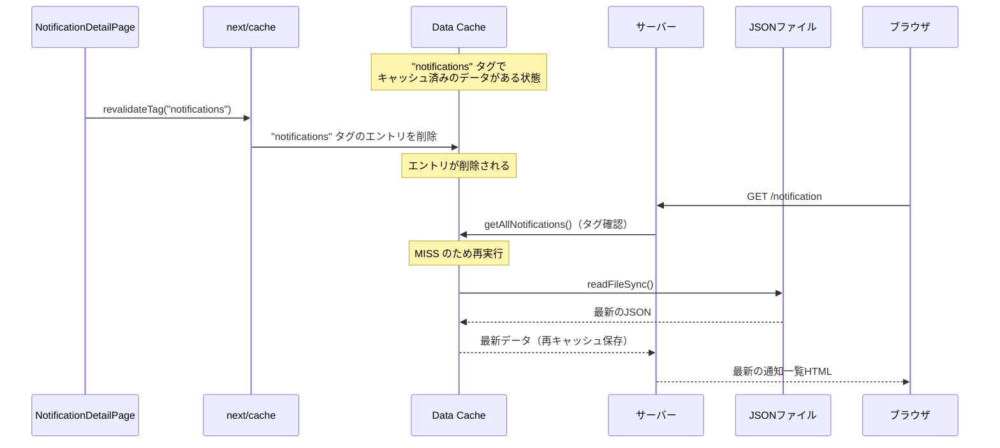
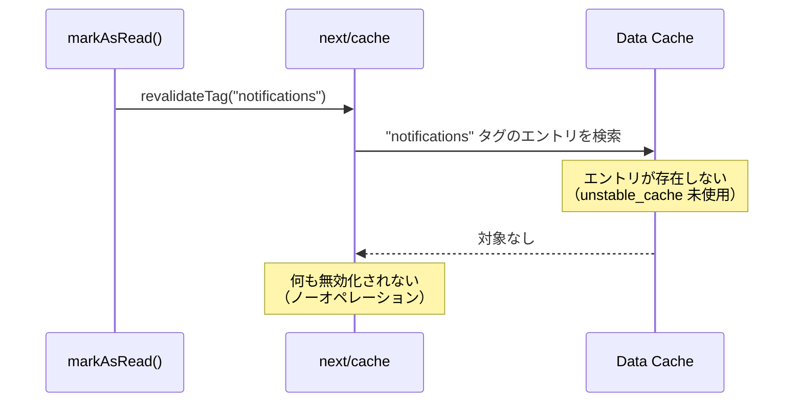
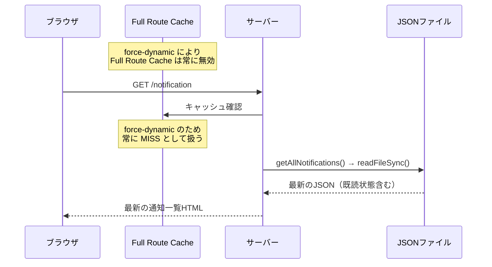
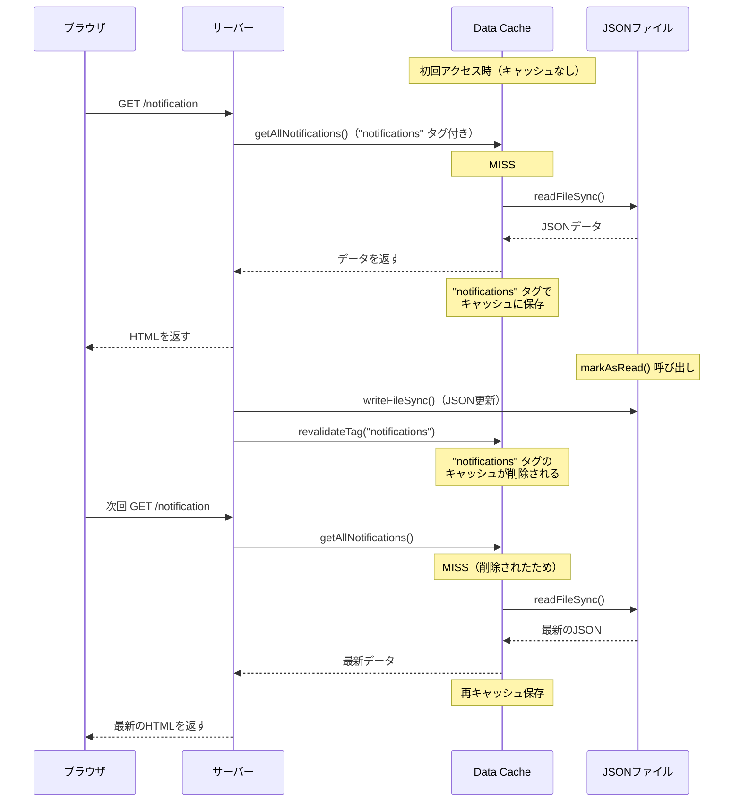

# revalidatePath と revalidateTag の設計・振る舞い・変更時の障害調査

## 1. Next.js のキャッシュ構造

Next.js には独立した3層のキャッシュがある。



---

## 2. revalidatePath の設計と振る舞い

### 設計上の役割

指定したURLパスに対応する Full Route Cache を削除する。
次のリクエスト時にサーバーがページを再レンダリングし、最新のHTMLを生成する。

### 振る舞い



### 特徴

- 無効化の対象はURLパスであり、データの種類ではない
- 呼び出し側がどのページに影響するかを全て列挙する必要がある
- 同じ通知データを表示するページが増えるたびに呼び出しを追加しなければならない

---

## 3. revalidateTag の設計と振る舞い

### 設計上の役割

指定したタグに紐づく Data Cache のエントリを削除する。
そのタグが付いた `fetch()` または `unstable_cache()` の結果が次回呼び出し時に再取得される。

### 振る舞い（unstable_cache を使っている場合）



### 特徴

- 無効化の対象はデータのタグであり、URLパスではない
- データ層が自分のタグを管理するため、呼び出し側はページ名を知る必要がない
- 通知データを表示するページが増えても、`revalidateTag` の呼び出し箇所は変わらない

---

## 4. 本プロジェクトの現状

### データ取得の実装

```typescript
// src/lib/notifications.ts
export function getAllNotifications(): Notification[] {
  return readNotifications(); // fs.readFileSync でJSONを読む
}
```

`fetch()` も `unstable_cache()` も使っていない。
Data Cache にエントリが存在しない状態。

### ページのキャッシュ設定

```typescript
// src/app/notification/page.tsx
export const dynamic = "force-dynamic";
```

`force-dynamic` により Full Route Cache が無効化されている。
毎リクエストでサーバーが必ずページを再実行する。

---

## 5. revalidatePath → revalidateTag 変更による障害分析

### 変更前のコード

```typescript
// src/app/notification/[id]/page.tsx（変更前）
markAsRead(params.id);
revalidatePath("/notification");
revalidatePath("/embed/notification");
```

### 変更後のコード（現在）

```typescript
// src/lib/notifications.ts（現在）
export function markAsRead(id: string): void {
  writeNotifications(updated);
  revalidateTag(NOTIFICATIONS_CACHE_TAG); // "notifications"
}
```

### 変更後に revalidateTag が行っている処理



### ページが正しく更新される理由

`revalidateTag` は何もしていないが、ページは正しく更新される。
理由は `force-dynamic` が Full Route Cache を完全に無効化しているためである。



### 障害が発生するか

**現在の実装では障害は発生しない。**
ただし、それは `revalidateTag` が機能しているためではない。
`force-dynamic` によって毎回サーバーレンダリングが走るため、
キャッシュ無効化の処理が空振りでも結果が一致している。

---

## 6. revalidateTag が機能するために必要な条件

`revalidateTag` を有効活用するには、データを `unstable_cache` でキャッシュする必要がある。

```typescript
// このように書いて初めて revalidateTag("notifications") が効く
export const getAllNotifications = unstable_cache(() => readNotifications(), ["notifications"], {
  tags: ["notifications"],
});
```

この構成にした場合の動作:



ただし `unstable_cache` を使う場合は `force-dynamic` との組み合わせに注意が必要である。
本プロジェクトでの検証では、開発サーバー上で `unstable_cache` と `force-dynamic` を
併用したとき E2E テストが失敗した。開発環境と本番環境でキャッシュの動作が異なるためである。

---

## 7. まとめ

| 項目                   | revalidatePath                                    | revalidateTag                                        |
| ---------------------- | ------------------------------------------------- | ---------------------------------------------------- |
| 無効化の対象           | Full Route Cache（URLパス単位）                   | Data Cache（タグ単位）                               |
| 呼び出し側の知識       | ページのURLパスを全て列挙する必要がある           | データのタグ名だけ知ればよい                         |
| 前提条件               | 特になし                                          | fetch() または unstable_cache() でのキャッシュが必要 |
| 関心の分離             | 弱い（データ更新側がページ構成を知る）            | 強い（データ層がタグを管理する）                     |
| 本プロジェクトでの効力 | **有効**（Full Route Cache を実際に削除している） | **無効**（Data Cache に対象エントリが存在しない）    |
| 本プロジェクトでの障害 | なし                                              | なし（force-dynamic が代わりに機能しているため）     |

### 現状の評価

`revalidateTag` への変更は関心の分離という設計意図として正しい方向性である。
ただし現在の実装では `revalidateTag` は空振りしており、
ページの更新は `force-dynamic` によって担保されている。

`revalidateTag` を実際に機能させるには `unstable_cache` の導入が必要だが、
`force-dynamic` との干渉や開発環境でのキャッシュ挙動の不安定さを別途検証する必要がある。
