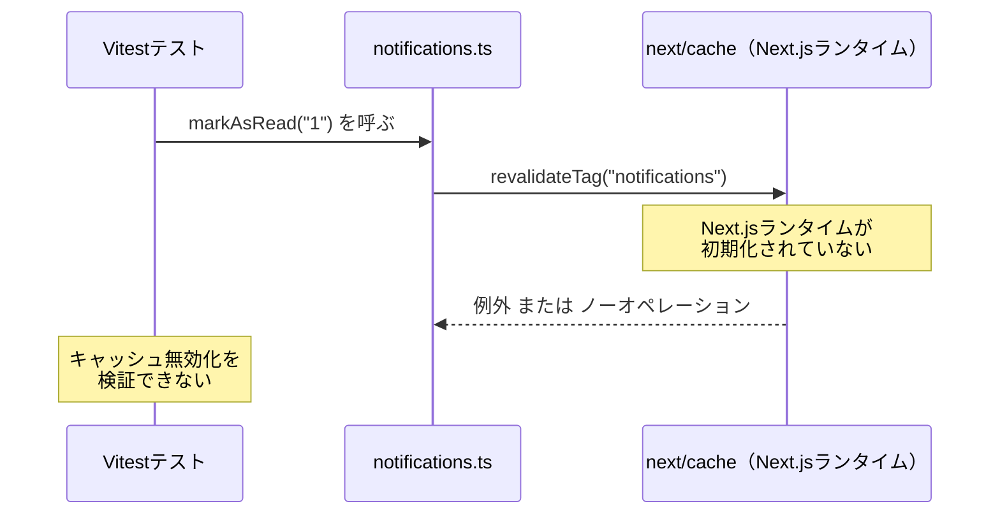
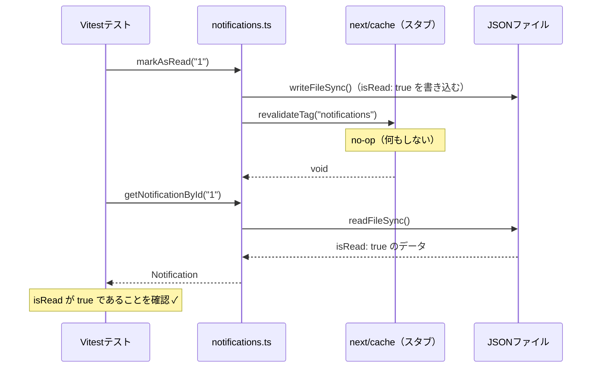
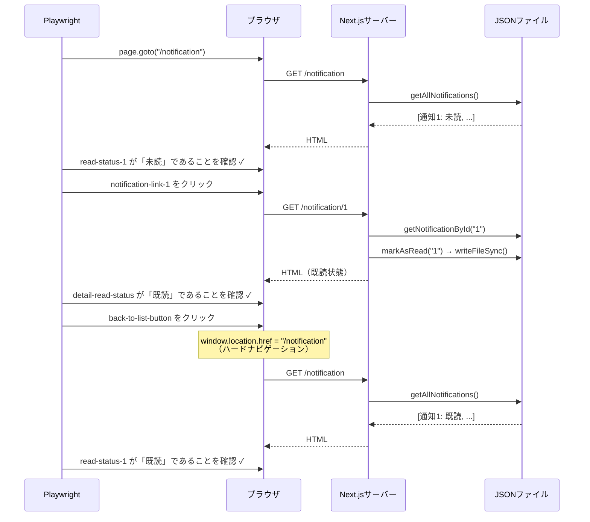
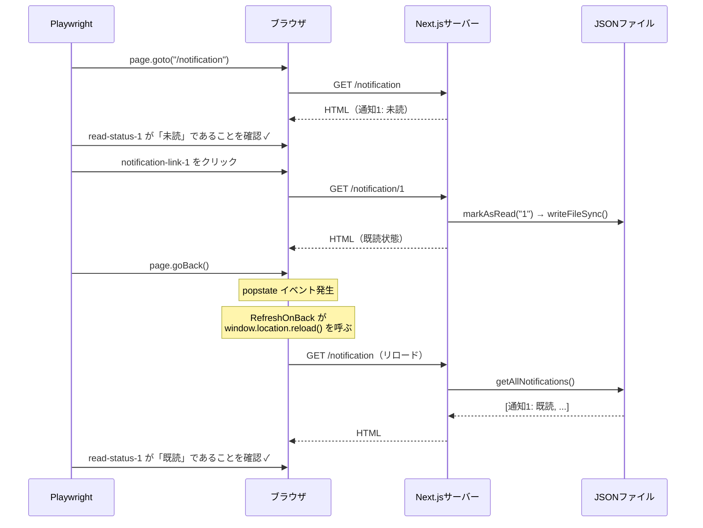
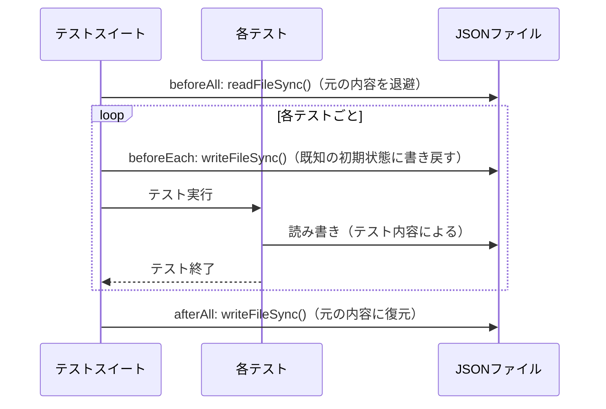

# revalidatePath / revalidateTag のテスト戦略

## 1. テストが困難な理由

`revalidatePath` と `revalidateTag` はどちらも **Next.jsランタイムに強く依存している**。
Node.jsプロセス単体（Vitestのnode環境）では呼び出しても例外が発生するか、
またはno-op（何もしない）として扱われる。



このため、これらの関数が「実際にキャッシュを無効化したか」という事実は
**ユニットテストで直接検証できない**。

---

## 2. テストレベルごとの責務分担

### ユニットテスト（Vitest）の責務

Next.jsランタイムの外側で検証できることに限定する。

- 通知データの読み書きロジック（JSONファイルの入出力）
- `markAsRead` を呼んだ後、同じプロセス内で読み取ると既読状態になること
- `markAllAsUnread` を呼んだ後、全件が未読になること

**検証できないこと:**

- `revalidateTag` / `revalidatePath` が実際にNext.jsのキャッシュを無効化したか
- キャッシュ無効化の結果としてブラウザ上の表示が更新されたか

### E2Eテスト（Playwright）の責務

実際にNext.jsサーバーを起動し、ブラウザ越しに振る舞いを検証する。
キャッシュ無効化の「結果」として画面が正しく更新されることを確認する。

- 通知詳細ページを開いた後に一覧に戻ると、既読ラベルに変化していること
- ブラウザバックで戻ったときも同様に既読ラベルが反映されていること
- 「一括未読にする」ボタンを押すと全件が未読ラベルになること

---

## 3. ユニットテストにおける next/cache のスタブ戦略

### 問題

`notifications.ts` は `revalidateTag` をimportしている。
Vitestのnode環境でこのファイルをimportすると `next/cache` の解決に失敗するか、
Next.jsランタイムへの依存が連鎖してテストが壊れる。

### 解決策：aliasによるスタブ置き換え

`vitest.config.ts` で `next/cache` をスタブモジュールに差し替える。

```typescript
// vitest.config.ts
alias: {
  "next/cache": path.resolve(__dirname, "src/__stubs__/next-cache.ts"),
}
```

```typescript
// src/__stubs__/next-cache.ts
// revalidateTag / revalidatePath をno-opとして定義する。
// テスト対象はキャッシュ無効化の副作用ではなく、
// データの読み書きロジックそのものであるため、no-opで十分である。
export function revalidatePath(): void {}
export function revalidateTag(): void {}
```

### このスタブが許容される理由



`revalidateTag` が呼ばれたかどうかは「副作用の呼び出し有無」であり、
その呼び出しが実際に Next.js のキャッシュを無効化したかは
Next.jsランタイムなしには検証できない。
E2Eテストが「画面上で既読状態が反映された」ことを保証するため、
ユニットテストはデータ永続化の正確さに専念すれば十分である。

---

## 4. 「revalidateTag が呼ばれたか」を検証したい場合

スタブを使いつつ呼び出し有無をアサートする方法は存在する。

```typescript
// スタブを spy 化する例（参考）
import * as nextCache from "next/cache"; // スタブ経由
vi.spyOn(nextCache, "revalidateTag");

markAsRead("1");

expect(nextCache.revalidateTag).toHaveBeenCalledWith("notifications");
```

ただし、このテストが保証するのは「`revalidateTag` という関数を正しい引数で呼んだか」
という事実のみである。スタブはno-opであるため、実際のキャッシュ無効化は
一切行われていない。

**このテストの限界:**

- タグ名 `"notifications"` を文字列として呼んでいることは確認できる
- そのタグが実際に Data Cache のエントリと一致しているかは確認できない
- キャッシュ無効化後にブラウザ上の表示が更新されることは確認できない

このテストは「実装の詳細」（どの関数をどの引数で呼ぶか）への依存度が高く、
リファクタリング時に壊れやすい。原則として採用しない。

---

## 5. E2Eテストがキャッシュ無効化を検証する仕組み

E2Eテストでは Next.js サーバーが実際に動いているため、
キャッシュの挙動を画面越しに検証できる。

### 通知詳細 → 一覧への戻り



### ブラウザバック



このテストが成功することは、データ書き込み・ページ再レンダリング・
画面反映の全体が正しく機能していることを保証する。

---

## 6. テスト初期化戦略（JSONファイルの保護）

E2EテストとユニットテストはどちらもJSONファイルを直接書き換えるため、
テスト実行前後のファイル状態の管理が必要になる。

### 両テストで採用している共通パターン

```typescript
// テスト開始前にファイル内容をメモリに退避する
beforeAll(() => {
  originalFileContent = fs.readFileSync(dataFilePath, "utf-8");
});

// テスト終了後にファイル内容を元に戻す
afterAll(() => {
  fs.writeFileSync(dataFilePath, originalFileContent, "utf-8");
});

// 各テスト開始前に既知の初期状態に書き戻す
beforeEach(() => {
  fs.writeFileSync(dataFilePath, JSON.stringify(testNotificationList, null, 2), "utf-8");
});
```



**この方針が必要な理由:**
E2Eテストは実際のサーバーを使うため、テスト中の書き込みが
次のテストの前提条件を破壊する可能性がある。
`workers: 1`（直列実行）と組み合わせることで、
テスト間でのファイル競合を防いでいる。

---

## 7. テスト戦略のまとめ

| 検証したいこと                 | 手段                     | 理由                                         |
| ------------------------------ | ------------------------ | -------------------------------------------- |
| 通知の読み書きロジック         | Vitest（ユニットテスト） | Next.jsランタイム不要                        |
| `revalidateTag` の呼び出し有無 | **検証しない**           | 実装詳細への依存度が高く、E2Eで代替可能      |
| キャッシュ無効化後の画面更新   | Playwright（E2Eテスト）  | Next.jsランタイムが必要                      |
| ブラウザバック後の画面更新     | Playwright（E2Eテスト）  | クライアントキャッシュの挙動はブラウザが必要 |

### 根拠となる原則

`revalidatePath` / `revalidateTag` は「キャッシュを無効化する命令を出した」という
副作用であり、その命令が正しく実行されたかどうかは Next.js の内部実装に依存する。

テストが保証すべきは「ユーザーが画面で見る状態が正しいか」であり、
「どの関数がどの引数で呼ばれたか」という実装詳細ではない。
E2Eテストが画面の正確さを保証する以上、
ユニットテストはデータ永続化ロジックに専念する構成が最も保守性が高い。
